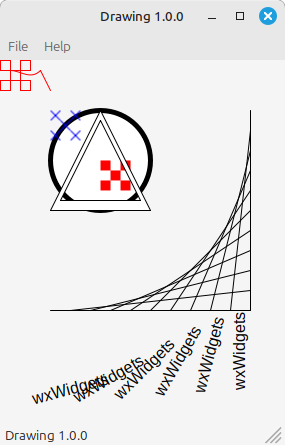

# wxWidgets Example Applications

## Introduction
This repository contains example applications demonstrating various features of [wxWidgets](https://www.wxwidgets.org/) library. These applications serve as part of additional materials for the book **"Cross-Platform Programming with C++ and wxWidgets 3"** by **Bartosz Warzocha**. The book can be found at:
[https://ksiegarnia.pwn.pl/Programowanie-wieloplatformowe-z-C-i-wxWidgets-3,750527898,p.html](https://ksiegarnia.pwn.pl/Programowanie-wieloplatformowe-z-C-i-wxWidgets-3,750527898,p.html)

All examples are licensed under the [wxWidgets License](https://www.wxwidgets.org/about/licence/).

The source code has been updated and tested on:
- **Windows 11** (Visual Studio 2022) with wxWidgets 3.3.x
- **Linux Mint 22** with wxWidgets 3.2.6

In every application folder you can find **Visual Studio solution & project** file, **Code::Blocks project** file and **makefile**, which allow you to build the app in every Windows or Linux OS.

_Additionally, all example applications have been fully translated into English. Originally, they were only available in Polish._

## Upgrade projects to your version of the wxWidgets: upgrade_wxwidgets.py

The `upgrade_wxwidgets.py` script allows automatic migration of wxWidgets versions in projects. It replaces references to older library versions with newer ones and updates Makefile configurations.

### Usage
1. Edit scirpt with your wxWidgets versions.
2. Run the script:
   ```sh
   python upgrade_wxwidgets.py
   ```
3. Enter the directory path containing the project files (`./`).
4. The script will automatically update all `.vcxproj`, `.sln`, and `Makefile` files.

## Directory Structure & Examples list

Here is a list of example apllications (as well as other add-ons) included in the repository.
- Note that some projects require additional files, which are usually placed in the Release_linux and Release_msw_x64 directories. If you are building the Debug version, you need to make sure that the additional files are also placed in the target directories.
- On some Linux distributions, it may be necessary to manually hardcode the Release_linux/obj and Debug_linux/obj directories before starting the build.

| Name | Description | Screenshot |
|------|------------|------------|
| **Base app** | Base application with some examples about mouse and keyboard events using. | |
| **Chess timer - wxPropertyGrid example** | Chess timer with properties realised with wxPropertyGrid. |  |
| **Combo list** | The example shows how you can implement combobox controls with your own advanced lists in a deopdown part. |  |
| **Command line** | This simple application shows the way of working with default wxWidgets command line parser. |  |
| **Console app** | Base console app. | |
| **Custom controls** | This programme demonstrates how to make some of your own GUI controls - from a simple graphical button, to a progress bar, to an advanced calendar. You simply have to see how easy it is with wxWidgets! |  |
| **Custom splashscreen** | Splashcreen with your own text or counter. |  |
| **DB (Soci + Firebird)** | The application shows how to easily combine working with wxWidgets and libraries for the popular Firebird database server. Please note that you must be familiar with SQL. | |
| **Dialogs** | This programme demonstrates all standard windows and dialogue functions available in wxWidgets. | |
| **DocMDI** | The app shows how to work with DocMDI. |  |
| **Drawing** | A simple application which show you how to draw with wxWidgets. |  |
| **File system** | What you can do with filesystem working with the wxWidgets library? You'll be surprised how much, just try it! |  |
| **FTP** | A simple FTP protocol example. |  |
| **Hangman game** | A simple game made in wxWidgets in which you have to guess the words made up by your opponent within a certain time, otherwise... I don't want to be in your shoes! |  |
| **HTTP** | A simple HTTP protocol example. |  |
| **Internationalization** | This program will teach you, how to work with different languages in wxWidgets GUI apps. |  |
| **Log** | Find out how you can collect diagnostic logs of your app using the powerful wxWidgets mechanisms. And this is possible in several interesting ways... |  |
| **MDI** | The app shows how to work with MDI. |  |
| **Multithreading** | One thread is not enough! See how to use multiple threads in the wxWidgets app. |  |
| **OpenGL** | A small introduction to the fascinating world of 3D. |  |
| **Socket** | A set of two applications demonstrating client/server communication. | |
| **Text editor - wxRibbonBar example** | Are standard toolbars boring you? The wxRibbonBar is an answer to your frustration! The programme not only shows you how to place the Ribbon Bar in your programme, but also provides information on how to make various advanced elements of the bar, such as galleries and others. |  |
| **Text editor - wxRichTextCtrl example** | WOW! My own 'Office Writer'! |  |
| **Time** | A simple time stuff example. |  |
| **Useful utilities** | Different files useful with some projects. |  |
| **Validators** | How to use validators? This app will give you an answer... |  |
| **wxAUI example** | The programme demonstrates how to use the advanced GUI mode of the wxAUI floating frame library. |  |
| **wxC++ (Your own IDE!)** | A simple, but fully-functional integrated development environment (IDE) with support for creating and organising a development project. The programme demonstrates working with wxScintiila and teaches how to implement not only code folding, but also how to perform syntax highlighting specific to selected keywords. | /screenshot.png) |

---
© 2018, 2025 Bartosz Warzocha (bartosz.warzocha@gmail.com)

